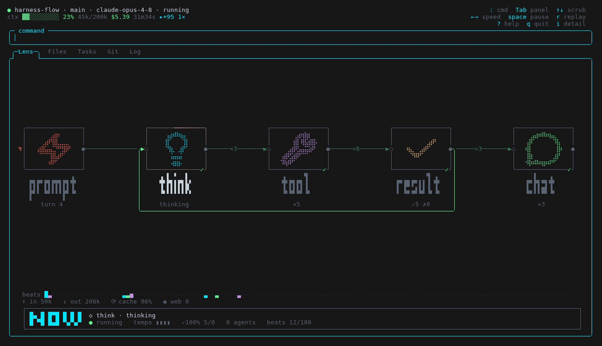

# ClawdLens

[](https://github.com/opariffazman/clawdlens/actions/workflows/ci.yml)
[](https://www.npmjs.com/package/clawdlens)
[](LICENSE)

Terminal glass box for your Claude Code sessions. A passive observer that tails
`~/.claude/projects/**/*.jsonl` and shows — at a calm, slow-burn pace — what every
running session is doing. Zero setup. No hooks. Never leave the terminal.

<p align="center">
  
</p>

The default view is the **Lens** — an n8n-style pipeline of the session's thinking →
tools → results, with a superpowers phase ribbon (Brainstorm → Spec → Plan → Execute →
Review → Ship), skills and subagents as sub-nodes, and a NOW heads-up display. Tab
through the rest: a **Files** heatmap, an agnostic **Tasks** list, a **Git** commit-graph,
and a **Log** of the raw event stream with an energy pulse. A header gauge tracks
status, tokens, cost and context the whole time.

## Install

Requires [Bun](https://bun.sh) ≥ 1.3.

```bash
bunx clawdlens                          # run without installing
# or install the command globally:
bun install -g clawdlens && clawdlens
```

Run from source instead:

```bash
git clone https://github.com/opariffazman/clawdlens
cd clawdlens && bun install
bun run dev
```

## Fonts

ClawdLens uses [Nerd Font](https://www.nerdfonts.com/) glyphs and powerline
separators by default. Install one and set it as your terminal font:

- macOS: `brew install --cask font-jetbrains-mono-nerd-font`
- Linux: download from <https://www.nerdfonts.com/font-downloads> and select it in
  your terminal

No Nerd Font? Use the plain-Unicode icon set:

```bash
CL_ICONS=unicode clawdlens
```

## Panels

`Tab`/`Shift-Tab` cycles between five views of the selected session. Every panel reads
off one shared timeline cursor, so they reveal and animate in sync.

- **Lens** *(default)* — an n8n-style pipeline canvas. Trigger half-pill and stage boxes
  (prompt → think → tool → result → chat) drawn with braille [lucide](https://lucide.dev)
  icons, persistent green trail wires labelled with traversal counts, and a coral ring
  orbiting the active node. Skills and subagents hang off as dashed sub-nodes; press `i`
  to flip the sub-row to a per-tool breakdown. Above it, a superpowers phase ribbon
  (Brainstorm → Spec → Plan → Execute → Review → Ship) and skill-timeline bands; below it,
  a NOW heads-up display with the live status and pace. A long think makes the box breathe.
- **Files** — a heatmap of every file the session touched, ranked by edits (`:sort` to
  re-rank by reads or recency).
- **Tasks** — an agnostic task list reconstructed from TodoWrite, the harness'
  TaskCreate/TaskUpdate events, and a superpowers-phase fallback.
- **Git** — a commit-graph of the session's repo, lanes coloured per branch, building up
  with a pulse.
- **Log** — the raw narrative event stream (thinking / text / tool / skill / result) with
  an energy pulse that runs while the timeline moves.

## Keys

`:` command palette (fuzzy) · `Tab`/`Shift-Tab` panels · `↑`/`↓` scrub timeline ·
`←`/`→` speed · `space` pause/play · `r` replay · `i` lens detail · `?` help · `q` quit.

Sessions live behind the palette: `:` → `sessions`, then `/` to fuzzy-filter the list.
The energy pulse runs automatically whenever the timeline is moving — no toggle. Quitting
with `q` restores the terminal cleanly (no Ctrl+C needed).

## How it works

ClawdLens is a passive reader. It tails the JSONL transcripts Claude Code writes to
`~/.claude/projects/**/*.jsonl`, folds them through a pure core
(`discover → tailer → parse → reducer → store`), and renders the result with
[OpenTUI](https://github.com/sst/opentui). It never writes to your sessions and
installs no hooks. See
[the design spec](https://github.com/opariffazman/clawdlens/blob/main/docs/superpowers/specs/2026-06-06-harness-flow-design.md)
for the original design.

## Limitations

- A permission prompt that blocks a session is indistinguishable from `running` via
  the transcript alone (no hooks), so it shows as `running`.
- Cost is an estimate.
- Context % can read above 100% for sessions on a 1M-context model — the transcript's
  model field omits the `[1m]` variant — though the gauge bar itself clamps.

## License

[MIT](LICENSE) © 2026 opariffazman
