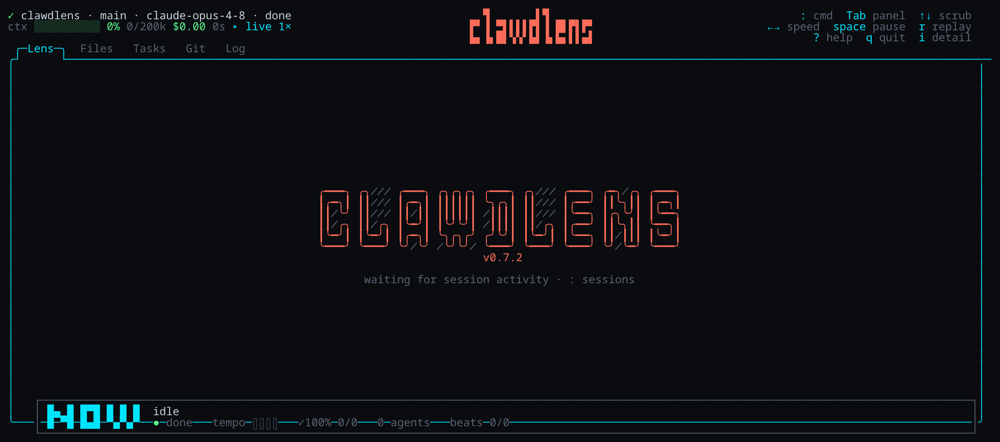
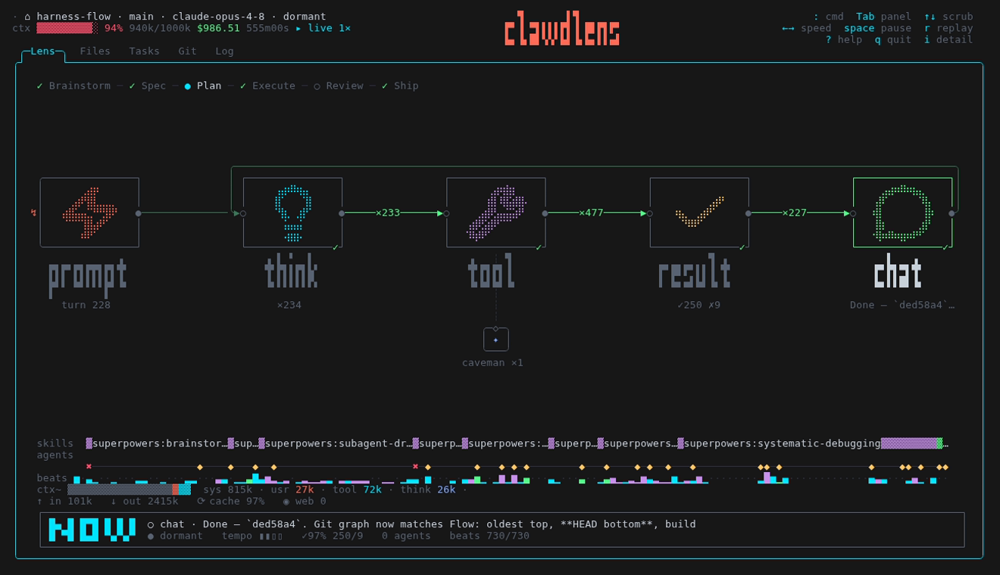
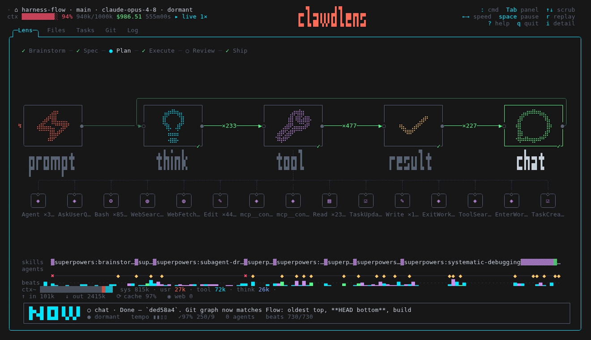
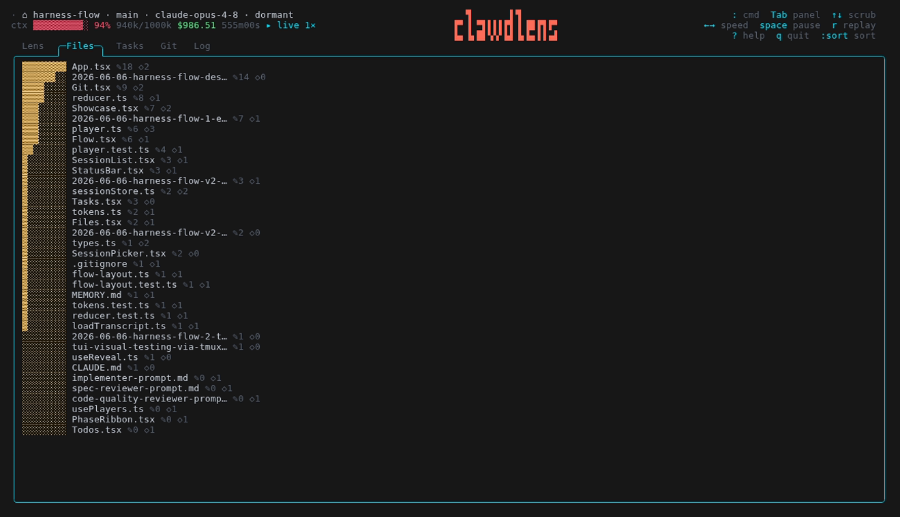
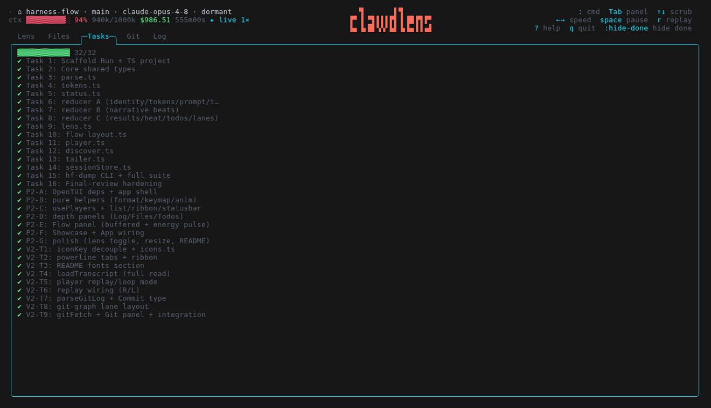
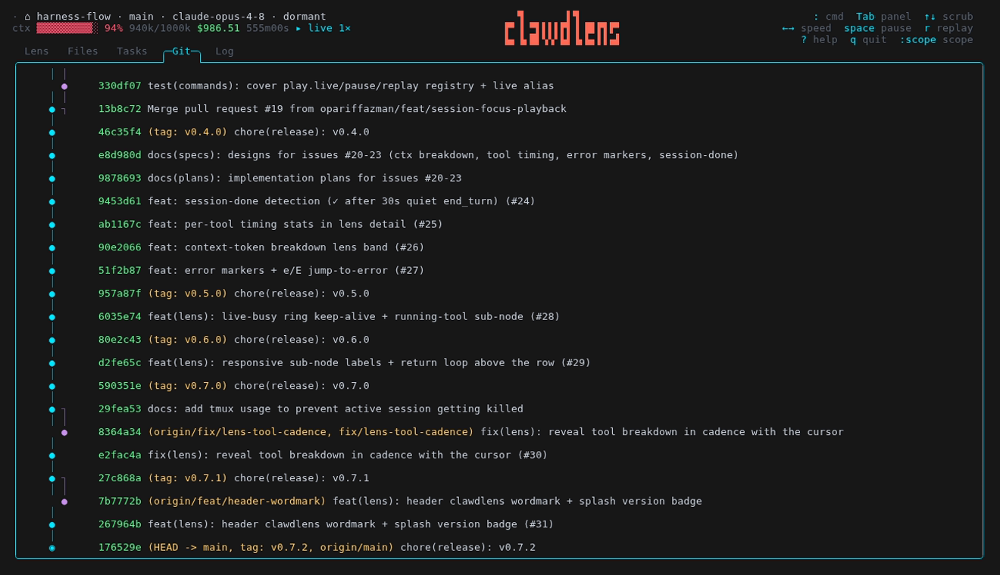
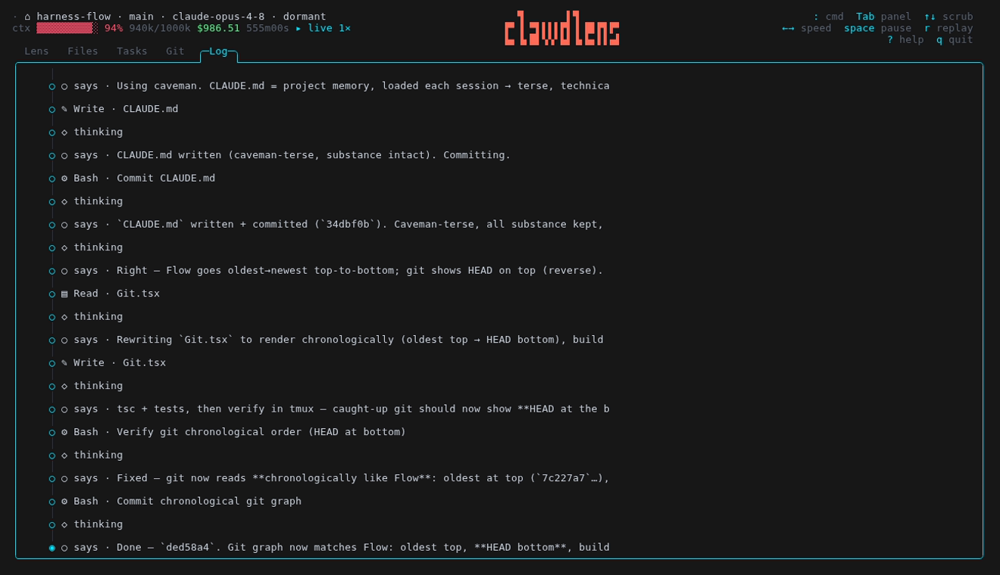

# ClawdLens

[](https://github.com/opariffazman/clawdlens/actions/workflows/ci.yml)
[](https://www.npmjs.com/package/clawdlens)
[](LICENSE)

<p align="center">
  
</p>

Terminal glass box for Claude Code sessions. Passive observer — tails
`~/.claude/projects/**/*.jsonl` and shows, at a calm slow-burn pace, what each running
session is doing. Zero setup. No hooks. Never leave the terminal.

<p align="center">
  
</p>

Default view is the **Lens** — a node / pipeline visual workflow of the session's
thinking → tools → results. Superpowers phase ribbon (Brainstorm → Spec → Plan → Execute
→ Review → Ship), skills and subagents as sub-nodes, NOW heads-up display. `Tab` through
the rest: a **Files** heatmap, an agnostic **Tasks** list, a **Git** commit-graph, a
**Log** event stream with energy pulse. Header gauge tracks status, tokens, cost, context
throughout.

## Install

Needs [Bun](https://bun.sh) ≥ 1.3.

```bash
bunx clawdlens                          # run without installing
# or install the command globally:
bun install -g clawdlens && clawdlens
```

Run from source:

```bash
git clone https://github.com/opariffazman/clawdlens
cd clawdlens && bun install
bun run dev
```

## Fonts

ClawdLens uses [Nerd Font](https://www.nerdfonts.com/) glyphs and powerline separators by
default. Install one, set it as your terminal font:

- macOS: `brew install --cask font-jetbrains-mono-nerd-font`
- Linux: grab one from <https://www.nerdfonts.com/font-downloads>, select it in your terminal

No Nerd Font? Use the plain-Unicode icon set:

```bash
CL_ICONS=unicode clawdlens
```

## Panels

`Tab`/`Shift-Tab` cycles five views of the selected session. All panels share one timeline
cursor — they reveal and animate in sync. The shots below all replay the same rich session:
clawdlens building itself.

### Lens *(default)*

<p align="center"></p>

Node / pipeline visual workflow canvas. Trigger half-pill plus stage boxes
(prompt → think → tool → result → chat) in braille [lucide](https://lucide.dev) icons,
green trail wires labelled with traversal counts, coral ring orbiting the active node.
Skills and subagents hang off as dashed sub-nodes. Above: the phase ribbon
(Brainstorm → Spec → Plan → Execute → Review → Ship) and skill-timeline bands. Below: the
NOW heads-up display (live status and pace). Long think → the box breathes.

Press `i` to flip the sub-row into a per-tool breakdown — every tool the session used, with
call counts and average durations:

<p align="center"></p>

### Files

<p align="center"></p>

Heatmap of every file the session touched, ranked by edits (`:sort` re-ranks by reads or
recency).

### Tasks

<p align="center"></p>

Agnostic task list, reconstructed from TodoWrite, harness TaskCreate/TaskUpdate events, and
a superpowers-phase fallback (`:hide-done` collapses the completed ones).

### Git

<p align="center"></p>

Commit-graph of the session's repo, lanes coloured per branch, builds up with a pulse
(`:scope` toggles all-branches vs current).

### Log

<p align="center"></p>

Raw event stream (thinking / text / tool / skill / result) with an energy pulse while the
timeline moves.

## Keys

`:` command palette (fuzzy) · `Tab`/`Shift-Tab` panels · `↑`/`↓` scrub · `←`/`→` speed ·
`space` pause/play · `r` replay · `i` lens detail · `?` help · `q` quit.

Sessions live behind the palette: `:` → `sessions`, then `/` to fuzzy-filter. Energy pulse
auto-runs while the timeline moves — no toggle. `q` restores the terminal cleanly (no
Ctrl+C).

## How it works

Passive reader. Tails the JSONL transcripts Claude Code writes to
`~/.claude/projects/**/*.jsonl`, folds them through a pure core
(`discover → tailer → parse → reducer → store`), renders with
[OpenTUI](https://github.com/sst/opentui). Never writes your sessions. No hooks. See the
[design spec](https://github.com/opariffazman/clawdlens/blob/main/docs/superpowers/specs/2026-06-06-harness-flow-design.md)
for the original design.

## Limitations

- A permission prompt blocking a session looks like `running` from the transcript alone
  (no hooks), so it shows as `running`.
- Cost is an estimate.
- Context % can read above 100% on 1M-context models — the transcript's model field omits
  the `[1m]` variant — but the gauge bar clamps.

## License

[MIT](LICENSE) © 2026 opariffazman
